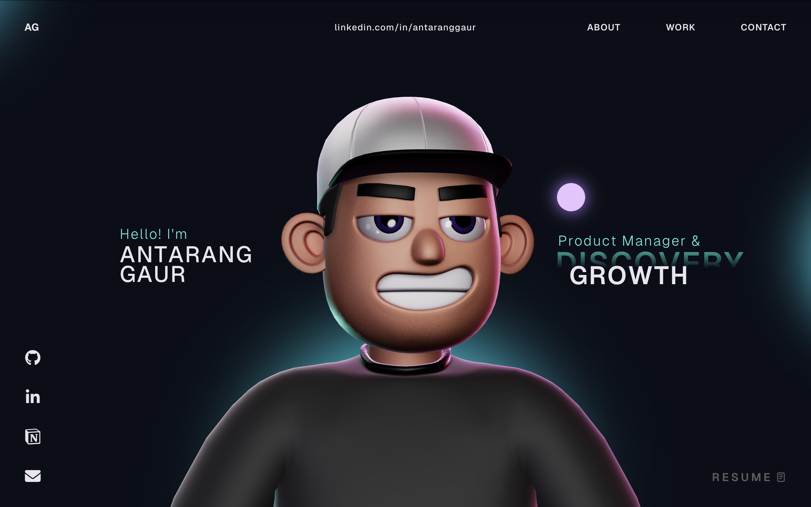

# Antarang Gaur — 3D Portfolio

Personal 3D portfolio of **Antarang Gaur** — AI Product Manager &amp; Growth. Built with React, TypeScript, Three.js, React Three Fiber, GSAP, and Rapier physics. The site is a scroll-driven single page with an animated 3D character, physics-driven tech-stack bubbles, a custom cursor, and smooth-scroll narrative transitions.

> 🔗 **Live:** [antarangportfolio.vercel.app](https://antarangportfolio.vercel.app/)
>
> © 2026 Antarang Gaur. All rights reserved.



---

## Table of Contents

- [Features](#features)
- [Tech Stack](#tech-stack)
- [Project Structure](#project-structure)
- [Section-by-Section](#section-by-section)
- [Notable Implementation Details](#notable-implementation-details)
- [Asset Sources](#asset-sources)
- [Roadmap](#roadmap)
- [License &amp; Ownership](#license--ownership)

---

## Features

- **Single-page narrative layout** that reads top-to-bottom like a story rather than a CV dump.
- **3D character scene** rendered with React Three Fiber + Three.js, lit by a custom HDR environment.
- **Physics-driven 3D tech-stack cluster** built on Rapier — every tool in my stack is a bouncing sphere you can poke with the cursor (or finger, on mobile).
- **Two-sided 3D logo bubbles** — each sphere shows the tool's logo on one hemisphere and the tool's name on the opposite hemisphere, generated dynamically from a `CanvasTexture`.
- **GSAP-driven smooth scrolling** with `ScrollSmoother` + `ScrollTrigger` for activation thresholds and parallax.
- **Custom cursor + hover-link affordances** that respond to interactive vs. non-interactive zones.
- **Animated career timeline** with a fixed right-aligned date column so multi-line role titles never break alignment.
- **Two-pillar "What I Do" cards** — Discovery &amp; Delivery and Growth &amp; GTM — with full skill-chip clouds.
- **Sales Intelligence Platform case study** as the first Work card, linking to a Notion deep-dive.
- **Loading sequence** with a pre-roll marquee ("AI Product Manager / Growth Strategist") and percentage progress.
- **Direct contact lines** — email, India + Germany phone numbers, LinkedIn, GitHub, Notion portfolio, downloadable résumé.

---

## Tech Stack

### Core

- **React 18**
- **TypeScript 5**
- **Vite 5**

### Animation and 3D

- **GSAP 3** with `@gsap/react`, `ScrollSmoother`, `ScrollTrigger`
- **three.js 0.168**
- **`@react-three/fiber`**
- **`@react-three/drei`**
- **`@react-three/rapier`** (physics)
- **`@react-three/postprocessing`** (N8AO ambient occlusion)
- **`@react-three/cannon`**
- **`three-stdlib`** (Draco decoder, loaders)

### Supporting Libraries

- **`react-icons`** (Fa6, Si, Md, Tb)
- **`react-fast-marquee`** (loading marquee)
- **`@vercel/analytics`**

---

## Project Structure

```text
.
├── public/
│   ├── images/                # tool logos (SVG), case-study covers
│   ├── models/                # character.enc + HDR environment
│   ├── draco/                 # Draco mesh decoder for runtime use
│   └── Antarang_Gaur_CV.pdf
├── src/
│   ├── assets/
│   ├── components/
│   │   ├── Character/         # 3D character + scene setup
│   │   ├── styles/            # per-section CSS
│   │   ├── utils/             # GSAP init, initial FX
│   │   ├── About.tsx
│   │   ├── Career.tsx
│   │   ├── Contact.tsx
│   │   ├── Cursor.tsx
│   │   ├── HoverLinks.tsx
│   │   ├── Landing.tsx
│   │   ├── Loading.tsx
│   │   ├── MainContainer.tsx
│   │   ├── Navbar.tsx
│   │   ├── SocialIcons.tsx
│   │   ├── TechStack.tsx      # two-sided CanvasTexture logo bubbles
│   │   ├── WhatIDo.tsx
│   │   ├── Work.tsx
│   │   └── WorkImage.tsx
│   ├── context/               # LoadingProvider
│   ├── data/                  # boneData for the 3D rig
│   ├── types/                 # ambient type defs
│   ├── App.tsx
│   └── main.tsx
├── package.json
└── vite.config.ts
```

---

## Section-by-Section

| Section | Purpose |
| --- | --- |
| **Landing** | Name, role, swap-tagline (Discovery ↔ Growth). 3D character anchors the right side. |
| **About** | One-paragraph positioning statement — Product Manager at sovity, AI-native discovery, ISM Dortmund, 4+ years enterprise SaaS background. |
| **Career** | Animated vertical timeline. Six roles from current (Product Owner, sovity) back to Transparency Market Research. |
| **What I Do** | Two interactive cards: *Discovery &amp; Delivery* and *Growth &amp; GTM*, each with paragraph + skill-chip cloud. |
| **Work** | Carousel of case studies. Anchored on the Sovity Sales Intelligence Platform. |
| **Tech Stack** | 3D physics cluster of 17 spheres — each is one tool (Power BI, Amplitude, Postgres, Python, Jira, Confluence, Figma, GitHub, Salesforce, Claude, Hugging Face, Miro, Monday.com, n8n, Lovable, Supabase, Vercel) with logo on one side and name on the other. |
| **Contact** | Email, India + Germany phone, LinkedIn, GitHub, Notion portfolio. Résumé download in the top-right. |

---

## Notable Implementation Details

### Two-sided 3D logo bubbles
Each sphere in the Tech Stack section is rendered with a dynamically generated `CanvasTexture` (1024 × 512). The canvas is split in half: the left half (maps to `u ≈ 0.25` on the sphere) carries the tool's logo, and the right half (maps to `u ≈ 0.75` — the opposite hemisphere) carries the tool's name in bold black, auto-fit to a single line. As the Rapier physics tumbles the cluster, you see the logo from one angle and the name from the other.

### Logo asset pipeline
All 17 tech-stack logos are sourced from [Iconify](https://iconify.design/) (`logos/*`, plus `simple-icons/anthropic` and `devicon/lovable` for the gaps). Each downloaded SVG is wrapped programmatically into a 256 × 256 canvas with a solid white background and the logo inset to 160 × 160 — giving every sphere a uniform, brand-correct finish regardless of the original logo's aspect ratio.

### Career timeline alignment
The date column is pinned to a 130 px right-aligned track via `flex: 0 0 130px; text-align: right; white-space: nowrap`. This stops the dates from drifting whenever a role title wraps to two lines.

### Smooth scrolling and section activation
GSAP `ScrollSmoother` drives the page; each section uses `ScrollTrigger` to swap visibility and physics states. The Tech Stack physics only activate after the user scrolls past `#work`, which keeps the framerate clean on the upper sections.

### Loading sequence
A pre-roll marquee shows the role (*AI Product Manager / Growth Strategist*), the percentage tracks asset load, and `initialFX` runs a GSAP timeline before handing off to the main page.

---

## Asset Sources

| Asset | Source |
| --- | --- |
| Tool logos | [Iconify](https://iconify.design/) — `logos/*`, `simple-icons/anthropic`, `devicon/lovable` |
| 3D character + HDR | bundled with project (encrypted `.enc` mesh + `char_enviorment.hdr`) |
| Draco decoder | bundled in `public/draco/` for runtime mesh decode |
| Fonts | system stack (Inter / Helvetica Neue / Arial) |
| Résumé PDF | authored by Antarang Gaur |
| SSI case-study cover | authored by Antarang Gaur |

---

## Roadmap

Tracked openly in the [Issues](../../issues) tab. Currently open:

- **Add more case studies to the Work carousel** — AI data matching in Catena-X, Power BI dashboards (Data Dynamics), AWS partner motion (Katalon)
- **Mobile polish + accessibility audit** — Lighthouse pass, axe scan, low-end-device fallback for the 3D scene
- **Light-mode toggle** — theme tokens, light HDR, `prefers-color-scheme` respect

Twelve closed issues document how the site was built end-to-end (scaffolding → sections → 3D bubbles → polish → docs).

---

## License &amp; Ownership

The 3D portfolio framework this project is built on is open-source under the MIT License; that original notice lives in [`LICENSE`](./LICENSE) as required by the license terms.

All **content** of this site — the bio, career history, case studies, résumé, photographs, skill descriptions, and all customizations made on top of the framework — is **© 2026 Antarang Gaur**. Cloning, redistribution, or reuse of the personalised content is not permitted without written consent.
